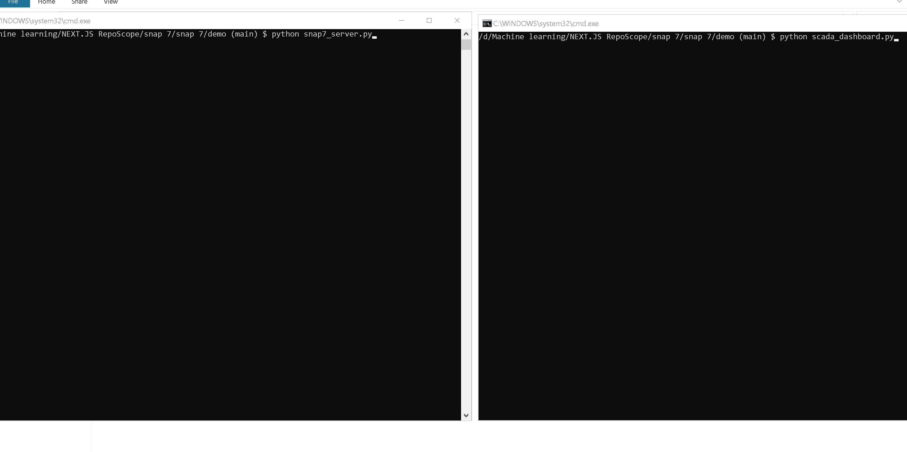

# Snap7 Qt Monitor & Diagnostic Station

[](https://github.com/esmaeilireza/snap7-qt-monitor/actions/workflows/ci.yml)
[](LICENSE)
[]()
[-green.svg)]()
[]()



A high-performance desktop commissioning workbench and diagnostic HMI for Siemens S7 PLCs, built with **PySide6 (Qt for Python)** and powered by the **Snap7** industrial communication suite.

Designed for automation engineers, system integrators, and software developers to inspect, validate, and test S7 Data Block (DB) communications during commissioning without requiring full engineering software suites like Step 7 or TIA Portal.

---

## 🎯 System Architecture & Design

The application enforces a strict separation between low-level socket communication, background telemetry polling, and the user interface to ensure high responsiveness and zero UI freezing:


```

┌─────────────────────────────────────────────────────────────┐
│                      PySide6 UI Layer                       │
│     (KPI Cards, PyQtGraph Charts, Event Logs, Settings)     │
└──────────────────────────────▲──────────────────────────────┘
│ Qt Signals & Slots
┌──────────────────────────────▼──────────────────────────────┐
│                    PLCWorker (QThread)                      │
│   (Background cyclic polling, reconnection, state tracker)  │
└──────────────────────────────▲──────────────────────────────┘
│ High-level Typed API
┌──────────────────────────────▼──────────────────────────────┐
│                     ForkClient Bridge                       │
│    (Python wrapper around python-snap7 / snap7 native DLL)  │
└──────────────────────────────▲──────────────────────────────┘
│ ISO-on-TCP (RFC 1006 / S7comm)
▼
Physical PLC or Mock Server

```

---

## ⚙️ Key Technical Features

* **Decoupled Asynchronous Polling:** Dedicated `QThread` polling loop running at a configurable interval (default 500 ms) guarantees an uninterrupted 60 FPS UI rendering pipeline.
* **Dual-Mode Operation (Live vs. Simulated):**
  * **LIVE Mode:** Connects to real Siemens hardware or a local Snap7 server over TCP port 102.
  * **SIMULATED Mode:** Built-in dynamic math generator simulating realistic thermal process curves with drift, Gaussian noise, and system resource metrics.
* **Automatic Network Failover:** Detects connection drops and gracefully degrades to internal loopback simulation to keep the UI operative without crashes or data corruption.
* **Dynamic S7 Mock Server (`snap7_server.py`):** Standalone multi-threaded server emulating a real Siemens PLC with auto-updating registers for offline integration testing.
* **Low-Overhead Telemetry Charting:** Powered by `pyqtgraph` with hardware-accelerated time-series rendering, custom dashed setpoint overlays, and mode-dependent visual cues.
* **Protocol Diagnostic Terminal:** Structured console logging incoming and outgoing frames, connection states, and setpoint dispatches with millisecond-accurate timestamps.

---

## 📊 Default Memory Mapping (DB1)

The station reads and writes to structured registers in **Data Block 1 (DB1)**:

| Offset | S7 Data Type | Python Equivalent | Description | Access |
| :--- | :--- | :--- | :--- | :--- |
| **0** | `REAL` | `float` (32-bit IEEE) | Process Temperature (°C) | Read-only |
| **4** | `REAL` | `float` (32-bit IEEE) | System CPU Metric (%) | Read-only |
| **8** | `REAL` | `float` (32-bit IEEE) | System RAM Metric (%) | Read-only |
| **12** | `REAL` | `float` (32-bit IEEE) | Temperature Setpoint Target | Read / Write |
| **16** | `BYTE` | `int` (8-bit unsigned) | Heartbeat Rolling Counter (0–255) | Read-only |

---

## 📁 Repository Structure


```

snap7-qt-monitor/
├── scada_dashboard.py       # Main GUI entry point & thread orchestrator
├── fork_bridge.py           # High-level typed client wrapper around Snap7
├── snap7_server.py          # Standalone dynamic mock PLC server
├── sensor_simulator.py      # Mathematical process generator (noise & drift)
├── test_bridge.py           # Comprehensive connectivity & unit test suite
├── config.ini               # Persistent network configuration (IP, Rack, Slot)
├── config.yaml              # Mock server memory configuration
├── requirements.txt         # Python package dependencies
├── snap7.dll                # Native Snap7 64-bit communication binary
├── ui/                      # Modular Qt UI components
│   ├── dashboard_ui.py      # Main window & layout orchestration
│   ├── chart_widget.py      # Real-time pyqtgraph telemetry widget
│   ├── status_cards.py      # KPI cards with live state indicators
│   ├── asset_panel.py       # Station navigation sidebar
│   ├── log_widget.py        # Real-time event logging terminal
│   ├── theme.py             # Dark industrial palette design tokens
│   ├── views.py             # Main dashboard multi-column layout
│   └── widgets.py           # Header, footer, and interactive control panels
└── LICENSE                  # LGPL-3.0 License

```

---

## 🚀 Getting Started

### 1. Requirements & Prerequisites

* Python **3.10+** (64-bit recommended).
* Windows 10/11 or Linux x86_64.
* For physical PLCs (S7-1200 / S7-1500):
  * **"Permit access with PUT/GET communication"** must be enabled in the CPU hardware configuration.
  * Data Block DB1 must use **Standard (Non-Optimized)** block access.

### 2. Installation

Clone the repository and install dependencies:

```bash
git clone [https://github.com/esmaeilireza/snap7-qt-monitor.git](https://github.com/esmaeilireza/snap7-qt-monitor.git)
cd snap7-qt-monitor
pip install -r requirements.txt

```

### 3. Launching the Station

#### Option A: Offline Simulation Mode (No hardware needed)

```bash
python scada_dashboard.py --simulate

```

#### Option B: Testing with Local Mock Server

1. Start the mock PLC server in a separate terminal:

```bash
python snap7_server.py

```

2. Launch the monitor dashboard:

```bash
python scada_dashboard.py

```

3. Set the target IP to `127.0.0.1`, Rack `0`, Slot `1` inside the **Settings** page or verify via `config.ini`.

#### Option C: Live PLC Deployment

Follow the complete deployment guide in the section **"Connecting to a Physical PLC"** below, or launch directly with your hardware parameters:

```bash
python scada_dashboard.py --ip 192.168.0.1 --rack 0 --slot 1

```

---

## ⌨️ Shortcuts & Hotkeys

* **`Ctrl + Shift + D`**: Toggles **High-Speed Demo Mode** (accelerates simulator drift, introduces random dynamic jumps, and enables the demo badge for video recording and demonstrations).

---

## 🔌 Connecting to a Physical PLC (Deployment Guide)

This guide describes the complete procedure for connecting the station to a real Siemens S7 PLC. Follow the steps in order; each step builds on the previous one.

### Step 1: PLC-Side Preparation (TIA Portal)

These settings are the most common cause of connection failures:

1. **Enable PUT/GET access:**
* In TIA Portal: `Device Configuration` -> select the CPU -> `Properties` -> `Protection & Security`.
* Enable **"Permit access with PUT/GET communication from remote partner"**.
* Compile and download the project to the PLC.


2. **Create a Standard (Non-Optimized) DB1:**
* Create a Global Data Block numbered **1** (or note the custom number you select).
* Right-click the DB -> `Properties` -> `Attributes` -> **disable "Optimized block access"**.
* This is mandatory: S7-1200/1500 blocks are Optimized by default, and Snap7 cannot address them by byte offset.
* Declare the following variables at the specified offsets:


| Offset | Type | Suggested Name | Access |
| --- | --- | --- | --- |
| 0.0 | `REAL` | Temperature | Read-only |
| 4.0 | `REAL` | CPU_Usage | Read-only |
| 8.0 | `REAL` | RAM_Usage | Read-only |
| 12.0 | `REAL` | Setpoint | Read / Write |
| 16.0 | `BYTE` | Heartbeat | Read-only |

3. **Assign a static IP address** to the PLC (e.g., `192.168.0.1`) and record it.

### Step 2: Network Setup

* Connect the host PC and the PLC to the same network switch or directly via an Ethernet cable.
* Configure the PC network adapter to the same subnet as the PLC (e.g., PLC: `192.168.0.1`, PC: `192.168.0.50` with Subnet Mask `255.255.255.0`).
* Verify basic ICMP connectivity:
```bash
ping 192.168.0.1

```


### Step 3: Dashboard Configuration

Edit `config.ini` (or use the GUI Settings panel / CLI flags):

```ini
[PLC]
ip = 192.168.0.1     ; Real PLC IP address
rack = 0              ; Default rack for modular racks (almost always 0)
slot = 1              ; S7-1200/1500: slot 1 | S7-300/400: typically slot 2
port = 102
mode = live

```

Back up the current simulation settings before modifying:

```bash
cp config.ini config_sim_backup.ini

```

### Step 4: Graduated Verification (Pre-Flight Checks)

Validate each protocol layer independently to isolate connectivity issues from application logic.

> **Port Conflict Note:** Ensure `snap7_server.py` is stopped before binding to a real PLC or running tests. Both require TCP port 102. If TIA Portal or Siemens SIMATIC S7DOS is installed locally, stop the background service (`s7oiehsx` / `s7oiehsx64`) via Windows Services if local port collisions occur.

**Test 1 — TCP & ISO-on-TCP Handshake:**

```python
import snap7

c = snap7.client.Client()
try:
    c.connect("192.168.0.1", 0, 1)  # (ip, rack, slot)
    print("STATUS: CONNECTED")
    c.disconnect()
except Exception as e:
    print(f"FAILED: {e}")

```

Common failure signatures:

| Error Code / Message | Probable Root Cause |
| --- | --- |
| `Connection refused` | PUT/GET access disabled in TIA, or incorrect IP / Rack / Slot. |
| `TCP: Connection timed out` | Cable disconnected, IP subnet mismatch, or local firewall blocking port 102. |
| `ISO: An error occurred during recv/send` | S7DOS port collision or invalid PDU negotiation parameters. |

**Test 2 — Target DB Read Verification:**

```python
import time
import snap7
from snap7.util import get_real

c = snap7.client.Client()
c.connect("192.168.0.1", 0, 1)

try:
    for _ in range(5):
        raw_bytes = c.db_read(1, 0, 4)  # Read 4 bytes from DB1 starting at offset 0
        temperature = get_real(raw_bytes, 0)
        print(f"Temperature: {temperature:.2f} °C")
        time.sleep(1)
finally:
    c.disconnect()

```

**Test 3 — Full Commissioning Workbench Execution:**

```bash
python -u scada_dashboard.py

```

Expected result: the embedded console reports `PLC: CONNECTED to 192.168.0.1:102`, status cards populate with real-time process values, and setpoint dispatches update the PLC register in real time (verifiable via a TIA Portal Watch Table).

### Deployment Notes

* **Custom DB Numbers:** If using a Data Block other than DB1 (e.g., DB5), update the target DB index within `config.ini` or update the calls (`c.db_read(1, ...)` -> `c.db_read(5, ...)`) across `fork_bridge.py` and `scada_dashboard.py`.
* **Firewall Configuration:** Ensure inbound and outbound traffic on **TCP Port 102** is allowed on any managed industrial firewalls or Windows Defender.

---

## 📄 License

This software is distributed under the **GNU Lesser General Public License v3.0 (LGPLv3)**. See [LICENSE](https://www.google.com/search?q=LICENSE) for details.

---

## 🌐 Acknowledgments

* **Davide Nardella** – Creator of the foundational [Snap7](https://snap7.sourceforge.net/) industrial communication library.
* **Gijs Molenaar** – Lead developer of the [python-snap7](https://github.com/gijzelaerr/python-snap7) bindings.
* The **Qt Company** & **PyQtGraph team** for high-performance desktop GUI and visualization tooling.

```

```